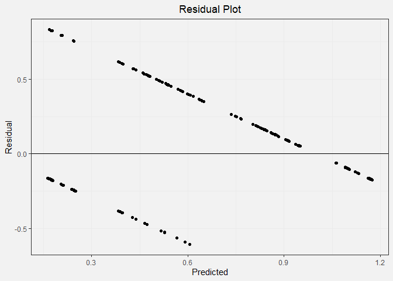
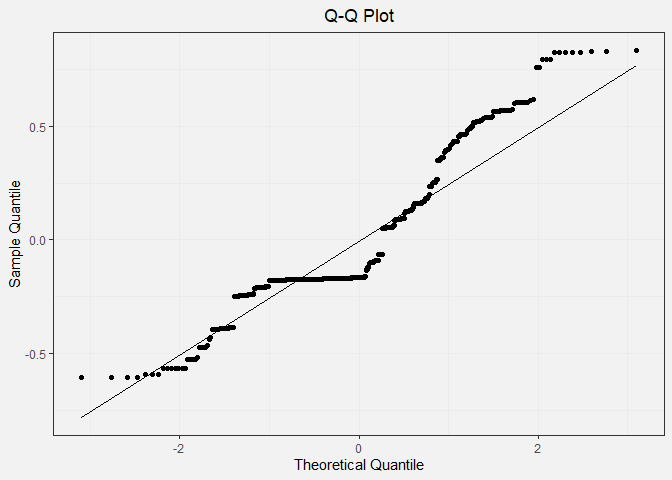

Linear Regression Model
================
Nilai Vemula
December 7, 2020

## Linear Regression Model

### Loading in Data

This notebook will be focused on building a predictive model from the
dataset. The response variable is class, and all other variables are
predictors. All predictors are categorical except for Age which is a
ordinal variable. In the encoding below, “Yes” is 1 and “No” is 0.
Additionally, “Male” is 0 and “Female” is 1 for the Gender column.

``` r
require(tidyverse)
set.seed(100)

data <- read_csv("../data/clean_numeric_data.csv")
head(data)
```

    ## # A tibble: 6 x 17
    ##     Age Gender Polyuria Polydipsia sudden.weight.l~ weakness Polyphagia
    ##   <dbl>  <dbl>    <dbl>      <dbl>            <dbl>    <dbl>      <dbl>
    ## 1    40      0        0          1                0        1          0
    ## 2    58      0        0          0                0        1          0
    ## 3    41      0        1          0                0        1          1
    ## 4    45      0        0          0                1        1          1
    ## 5    60      0        1          1                1        1          1
    ## 6    55      0        1          1                0        1          1
    ## # ... with 10 more variables: Genital.thrush <dbl>, visual.blurring <dbl>,
    ## #   Itching <dbl>, Irritability <dbl>, delayed.healing <dbl>,
    ## #   partial.paresis <dbl>, muscle.stiffness <dbl>, Alopecia <dbl>,
    ## #   Obesity <dbl>, class <dbl>

### Building the linear model

Using the results of the chi-square feature selection process from
earlier, we will limit the linear regression model to the six variables
we investigated above.

``` r
# building the linear model
model <- lm(class ~ Age + Gender + Polyuria + Polydipsia + sudden.weight.loss + partial.paresis, data=data)

summary(model)
```

    ## 
    ## Call:
    ## lm(formula = class ~ Age + Gender + Polyuria + Polydipsia + sudden.weight.loss + 
    ##     partial.paresis, data = data)
    ## 
    ## Residuals:
    ##     Min      1Q  Median      3Q     Max 
    ## -0.6059 -0.1747 -0.1662  0.1614  0.8311 
    ## 
    ## Coefficients:
    ##                      Estimate Std. Error t value Pr(>|t|)    
    ## (Intercept)         0.1885380  0.0580208   3.249  0.00123 ** 
    ## Age                -0.0003632  0.0011812  -0.307  0.75864    
    ## Gender              0.2190474  0.0314266   6.970 9.77e-12 ***
    ## Polyuria            0.3623175  0.0367050   9.871  < 2e-16 ***
    ## Polydipsia          0.3052143  0.0361974   8.432 3.47e-16 ***
    ## sudden.weight.loss  0.0710132  0.0319390   2.223  0.02662 *  
    ## partial.paresis     0.0400450  0.0330831   1.210  0.22667    
    ## ---
    ## Signif. codes:  0 '***' 0.001 '**' 0.01 '*' 0.05 '.' 0.1 ' ' 1
    ## 
    ## Residual standard error: 0.3113 on 513 degrees of freedom
    ## Multiple R-squared:  0.596,  Adjusted R-squared:  0.5913 
    ## F-statistic: 126.1 on 6 and 513 DF,  p-value: < 2.2e-16

From the summary of the model, we see that all the variables have
p-values\<0.05, indicating statistically significant relationships,
except for Age and Partial Paresis. Additionally, all variables except
for Age have a positive slope which makes sense given that our bar
charts show that answering “Yes” for these risk factors or being female
makes it much more likely for a patient to have diabetes.

We can also calculate the following performance metrics for our model.

Mean Squared Prediction Error (MSPE):

``` r
mean(model$residual^2)
```

    ## [1] 0.09561477

\(R^2\):

``` r
summary(model)$r.squared 
```

    ## [1] 0.5960276

### Checking Assumptions

For a linear model, we first check to see if the relationships in the
linear model are independent. These risk factors in the dataset are not
necessarily independent. In particular, as evidenced from the
correlation heatmap plot from earlier, polydipsia and polyuria are
highly correlated with each other. They also have a biological link. The
independence assumption of the linear model is not met.

Residual Plot:

``` r
mod_results <- data.frame(observed = data$class, predicted = model$fitted.values, residual = model$residuals)
head(mod_results)
```

    ##   observed predicted   residual
    ## 1        1 0.4792263 0.52077365
    ## 2        1 0.2075204 0.79247964
    ## 3        1 0.5359663 0.46403365
    ## 4        1 0.2432095 0.75679047
    ## 5        1 0.9453391 0.05466093
    ## 6        1 0.8360966 0.16390344

``` r
ggplot(mod_results, aes(y = residual, x = predicted)) + 
    geom_point() + 
    geom_hline(yintercept = 0) +
      theme_bw() +
  labs(title="Residual Plot", x="Predicted", y="Residual") +
  theme(plot.title = element_text(hjust = 0.5)) +
  theme(plot.background = element_rect(fill = '#f2f2f2', colour = '#f2f2f2')) +
  theme(panel.background = element_rect(fill = '#f2f2f2', colour = '#f2f2f2'))
```

<!-- -->

``` r
ggsave("../plots/residual_plot.png", dpi = 1200, width = 4, height = 4, units = "in")
```

In the residual plot, we expect to see symmetrically distributed points
forming a cloud. We also hope to see low residual values and no clear
patterns. This is not the case for our data because the output must be a
0 or a 1. This causes the linear regression model to form two
distinctive lines on the plot.

Q-Q Plot:

``` r
ggplot(mod_results, aes(sample = residual)) + 
    geom_qq()+
  geom_qq_line() +
  theme_bw() +
  labs(title="Q-Q Plot", x="Theoretical Quantile", y="Sample Quantile") +
  theme(plot.title = element_text(hjust = 0.5)) +
  theme(plot.background = element_rect(fill = '#f2f2f2', colour = '#f2f2f2')) +
  theme(panel.background = element_rect(fill = '#f2f2f2', colour = '#f2f2f2'))
```

<!-- -->

``` r
ggsave("../plots/qq_plot.png", dpi = 1200, width = 4, height = 4, units = "in")
```

In the Q-Q plot, we expect to see the points in the scatter plot to
closely follow the diagonal line. This pattern is clearly not observed.

The mean and standard deviation for our residuals can be calculated as
such:

``` r
mean_res <- mean(mod_results$residual)
sd_res <- sd(mod_results$residual)
print(c(mean_res, sd_res))
```

    ## [1] -2.469760e-17  3.095141e-01

### Conclusion

Overall, our assumptions are not met, and a linear regression model is
not a good way to model our data.
