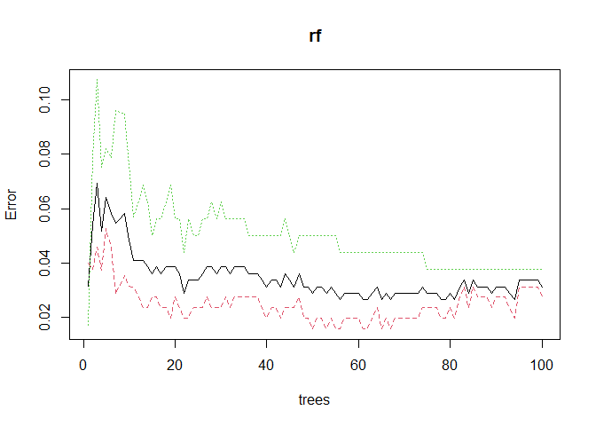

Random Forest Model
================
Nilai Vemula
December 7, 2020

## Random Forest Model

### Loading Random Forest Libraries

``` r
require(randomForest)
require(caTools)
require(tidyverse)

set.seed(2020)
```

### Loading in Data

We can read in the data using the `read_csv()` function. The parameters
included in this function are to transform the categorical data into
factor data types for easy analysis later on.

``` r
diabetes_data_upload <- read_csv(
  "../data/diabetes_data_upload.csv",
  col_types = cols(
    Gender = col_factor(levels = c("Male",
                                   "Female")),
    Polyuria = col_factor(levels = c("Yes",
                                     "No")),
    Polydipsia = col_factor(levels = c("Yes",
                                       "No")),
    `sudden weight loss` = col_factor(levels = c("Yes",
                                                 "No")),
    weakness = col_factor(levels = c("Yes",
                                     "No")),
    Polyphagia = col_factor(levels = c("Yes",
                                       "No")),
    `Genital thrush` = col_factor(levels = c("Yes",
                                             "No")),
    `visual blurring` = col_factor(levels = c("Yes",
                                              "No")),
    Itching = col_factor(levels = c("Yes",
                                    "No")),
    Irritability = col_factor(levels = c("Yes",
                                         "No")),
    `delayed healing` = col_factor(levels = c("Yes",
                                              "No")),
    `partial paresis` = col_factor(levels = c("Yes",
                                              "No")),
    `muscle stiffness` = col_factor(levels = c("Yes",
                                               "No")),
    Alopecia = col_factor(levels = c("Yes",
                                     "No")),
    Obesity = col_factor(levels = c("Yes",
                                    "No")),
    class = col_factor(levels = c("Positive",
                                  "Negative"))
  )
)

diabetes_data_upload <- data.frame(diabetes_data_upload)

summary(diabetes_data_upload)
```

    ##       Age           Gender    Polyuria  Polydipsia sudden.weight.loss weakness 
    ##  Min.   :16.00   Male  :328   Yes:258   Yes:233    Yes:217            Yes:305  
    ##  1st Qu.:39.00   Female:192   No :262   No :287    No :303            No :215  
    ##  Median :47.50                                                                 
    ##  Mean   :48.03                                                                 
    ##  3rd Qu.:57.00                                                                 
    ##  Max.   :90.00                                                                 
    ##  Polyphagia Genital.thrush visual.blurring Itching   Irritability
    ##  Yes:237    Yes:116        Yes:233         Yes:253   Yes:126     
    ##  No :283    No :404        No :287         No :267   No :394     
    ##                                                                  
    ##                                                                  
    ##                                                                  
    ##                                                                  
    ##  delayed.healing partial.paresis muscle.stiffness Alopecia  Obesity  
    ##  Yes:239         Yes:224         Yes:195          Yes:179   Yes: 88  
    ##  No :281         No :296         No :325          No :341   No :432  
    ##                                                                      
    ##                                                                      
    ##                                                                      
    ##                                                                      
    ##       class    
    ##  Positive:320  
    ##  Negative:200  
    ##                
    ##                
    ##                
    ## 

In the summary of our data, we see that there are more patients with
diabetes than without, which calls into question the validity of our
model. While dataset is unbalanced, 320 vs 200 is not a very large
difference, so our model should still be reasonably accurate.

### Splitting Data into a Training and Testing Set

In preparation modeling our data, we can first separate it into a
testing and a training set with a split ratio of 0.8. This means that
80% of our overall dataset will be used for training and 20% will be
used for testing the model at the end.

``` r
sample = sample.split(diabetes_data_upload$class, SplitRatio = .80)
train = subset(diabetes_data_upload, sample == 1)
test  = subset(diabetes_data_upload, sample == 0)

dim(train)
```

    ## [1] 416  17

``` r
dim(test)
```

    ## [1] 104  17

### Building the Model

We will build a random forest model using the `randomForest()` function
and typical default parameter values of 100 trees in the forest.

``` r
rf <- randomForest(
  class ~ .,
  data=train,
  ntree = 100,
  importance = TRUE
)
rf
```

    ## 
    ## Call:
    ##  randomForest(formula = class ~ ., data = train, ntree = 100,      importance = TRUE) 
    ##                Type of random forest: classification
    ##                      Number of trees: 100
    ## No. of variables tried at each split: 4
    ## 
    ##         OOB estimate of  error rate: 3.12%
    ## Confusion matrix:
    ##          Positive Negative class.error
    ## Positive      249        7  0.02734375
    ## Negative        6      154  0.03750000

``` r
train_accuracy <- (rf$confusion[1,1] + rf$confusion[2,2]) / (dim(train)[1]) 
```

After training the random forest model, we see that our model has a
training accuracy of 96.9%.

We can plotting the model error vs the number of trees in the forest
below and we observe that our model likely does not need the default
amount of 100 trees. The error starts to sharply decrease with the first
few trees, but then it quickly plateaus.

``` r
plot(rf)
```

<!-- -->

### Variable Importance

``` r
par(bg="#f2f2f2")
varImpPlot(rf, main="Variable Importance Plot", type=1, pch=19)
```

<!-- -->

``` r
dev.copy(png, filename = "../plots/variable_importance.png", width = 8, height = 6, units="in", res=400)
```

    ## png 
    ##   3

``` r
dev.off()
```

    ## png 
    ##   2

The random forest model is very interesting because it can allow us to
investigate the relative importance of the variables that we use in our
model. In the variable importance plot above, we see that polydipsia,
polyuria, gender, and age are the four most important variables in our
model. This is determined by computing the `MeanDecreaseAccuracy`. This
quantity is calculated by changing the values in each feature and then
observing how much that change decreases the accuracy of the model. An
interesting conclusion from this plot is that age is very important to
the accuracy of the model. In our density plots above, we concluded that
there was only a slight difference in the mean ages between the patients
that had diabetes and did not have diabetes, and age also was not
statistically significant in the linear model. Therefore, it is likely
that age has a nonlinear relationship with the diabetes status of a
patient or that age in combination with another factor is an important
predictor.

### Validating on the Testing Set

Seeing that the model had good accuracy on the training set and the
conclusions from the variable importance plot are reasonable, we can now
validate our model on the remaining 20% of the dataset. We use our
random forest model to generate predictions for the remaining samples
and then compare those with the observed diabetes status of those
patients. Finally, we can visualize this with a confusion matrix.

``` r
prediction_for_table <- predict(rf,test[,-17])
confusion <- table(observed=test[[17]],predicted=prediction_for_table)
confusion
```

    ##           predicted
    ## observed   Positive Negative
    ##   Positive       64        0
    ##   Negative        2       38

``` r
true_class <- factor(c('Negative', 'Negative', 'Positive', 'Positive'))
predicted_class <- factor(c('Negative', 'Positive', 'Negative', 'Positive'))
counts      <- c(confusion[2,2], confusion[2,1], confusion[1,2], confusion[1,1])
df <- data.frame(true_class, predicted_class, counts)


ggplot(data =  df, mapping = aes(x = true_class, y = predicted_class)) +
  geom_tile(aes(fill = counts), colour = "white") +
  geom_text(aes(label = sprintf("%1.0f", counts)), vjust = 1, colour="white") +
  scale_fill_gradient() +
  theme_bw() + theme(legend.position = "none") +
  labs(title="Confusion Matrix",x="True Class", y="Predicted Class")+
  theme(plot.title = element_text(hjust = 0.5)) +
  theme(plot.background = element_rect(fill = '#f2f2f2', colour = '#f2f2f2')) +
  theme(panel.background = element_rect(fill = '#f2f2f2', colour = '#f2f2f2'))
```

<!-- -->

``` r
ggsave("../plots/confusion_matrix.png", width = 4, height = 4, units = "in",dpi= 1200)
```

``` r
test_accuracy <- (confusion[2,2] + confusion[1,1])/sum(confusion)
print(test_accuracy)
```

    ## [1] 0.9807692

From our confusion matrix, we can see that the testing accuracy of our
model is 98.1%. This value is similar to that of our training accuracy,
indicating that our model is not over-fitting to the data. These model
accuracy values are very good, and our model has great predictive power.
We can do further hyper-parameter tuning to improve our model more, but
that is out of the scope of this project.
