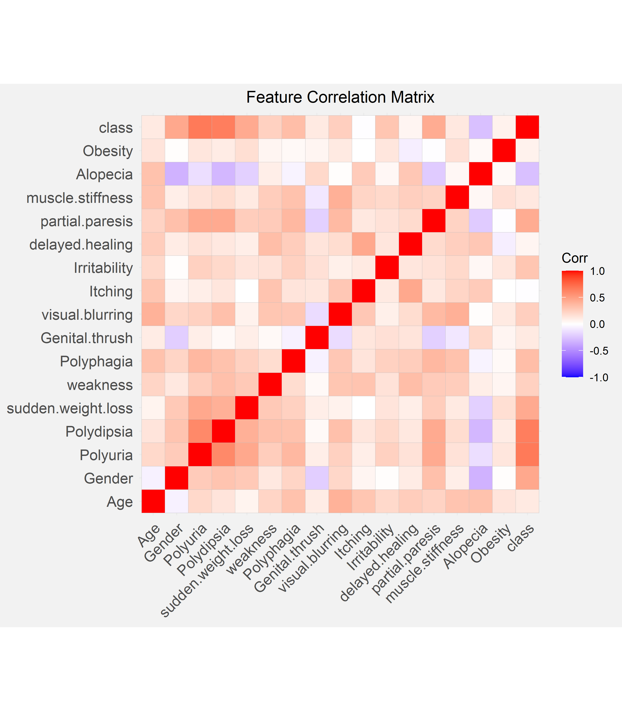

MATH 2820L Final Project

By Nilai Vemula, Anvitha Kosuraju, and Sithara Samudrala

Table of Contents:

* TOC
{:toc}

# Introduction:

The data we are analyzing were collected using direct questionnaires from patients from the Sylhet Diabetes Hospital that were located in Sylhet, Bangladesh. We found this data through the UCI Machine Learning Repository. Our data is collected from 520 patients from this hospital. The data provides information that points to possible correlations between having diabetes and other factors. These other factors include age, sex, polyuria, polydipsia, sudden weight loss, weakness, polyphagia, genital thrush, visual blurring, itching, irritability, delayed healing, partial paresis, muscle stiffness, alopecia, and obesity. Out of these variables, we had one ordinal variable, which was age. All of the other variables were categorical with either a "yes" or "no" answer. The response variable was "Class", which could either be "positive" or "negative" for diabetes. All of the answers from this questionnaire were approved by a doctor to make it reliable. 

Through this project, we want to understand these possible and common risk factors that are tied to diabetes and to understand any patterns that occur between having diabetes and the presence of risk factors such as old age, obesity, polyuria, polydipsia, and other factors mentioned within the dataset. The main problem that we are trying to tackle is to see the patterns that occur within the data and decipher these patterns. We want to find the patterns that occur with the factors that are presented within the data and the presence of Diabetes within the individual. By finding these patterns, we can flag individuals with similar factors that might indicate that the individual has a high chance of developing diabetes. One of the most important things with overcoming diabetes is early diagnosis, so by finding these patterns that occur between certain factors and having diabetes, we can help find these flags that can lead to an early diagnosis. 

In conclusion, our main goals were to analyze the various data that were included to make important conclusions about diabetes and related medical conditions. We also wanted to build a predictive model to be able to accurately determine if a specific patient has diabetes given their medical data, history, and symptoms. Additionally, we want to be able to determine which factors out of the variables in our data are the best predictors for if a specific patient will be diagnosed with diabetes or not. 

# Data:

In the dataset, out of the 520 patients, 320 of the patients were diagnosed with Diabetes and 200 of the patients were not diagnosed with Diabetes. This is important to know, so we can see the factors that predominantly occurred with the 320 patients that were diagnosed versus 200 patients that were not diagnosed with diabetes. 

## Correlation Matrix:



## Feature Selection

Chi-square feature selection was used as our method for selecting some of our 15 categorical predictor variables for further analysis.

|      Feature       | 𝜒2 Test Statistic |
| :----------------: | :---------------: |
|      Polyuria      |       227.9       |
|     Polydipsia     |       216.2       |
|       Gender       |       103.1       |
| Sudden Weight Loss |       97.3        |
|  Partial Paresis   |       95.4        |
|     Polyphagia     |       59.6        |
|    Irritability    |       45.2        |
|      Alopecia      |       36.1        |
|  Visual Blurring   |       31.8        |
|      Weakness      |       29.8        |


### Selected Features:
We chose the variables with the highest chi-square values (Polyuria, Polydipsia, Gender, Sudden Weight Loss, and Partial Paresis) along with Age to investigate further. 

When analyzing the various features we selected, we first came to an initial hypothesis as a group. We then created bar charts to provide an analysis of the specific variable and how this affects the possibility of diagnosis for diabetes. Then, we came to a conclusion based on our analysis of the bar chart. Our conclusion was based on if our bar chart supported or contradict the initial hypothesis, and what our bar chart indicated was the relationship between the variable and the possible diagnosis for diabetes.

## Age:

### INITIAL HYPOTHESIS:

Our initial hypothesis was that if the patient was older, the patient has a higher chance of being diagnosed with diabetes. This initial hypothesis was primarily based on our prior experience and knowledge. Most of the individuals that we personally know that are diagnosed with diabetes were diagnosed later in life, but we did consider how there are two types of diabetes and the onset of these two types. Type I typically is diagnosed in children and teens and Type II is typically diagnosed in adulthood. Given that Type II diabetes is notably more prevalent than Type I, we still expected the data to show a positive correlation between age and diabetes diagnosis though the data does not distinguish between either type of diabetes. Out of the 520 patients that were interviewed, the ages ranged from 16 to 90. The mean age of the patients with diabetes was 49.07, and the mean age of the patients without diabetes was 46.36.

### BAR CHART:


### CONCLUSION:


## Gender:


## Polyuria:

### INITIAL HYPOTHESIS:

Polyuria is the production of abnormally large volumes of dilute urine. Our initial hypothesis was that if the patient experienced polyuria, they have a higher chance of being diagnosed with diabetes. We came to this initial hypothesis through some research and prior knowledge. If an individual has diabetes, they tend to have higher blood sugar levels, and their kidney will try to filter out their high blood sugar levels. This produces a lot of excess urine, leading to polyuria. Out of the 520 patients that were interviewed, 258 had polyuria and 262 did not have polyuria. 

### BAR CHART:


### CONCLUSION:

From the bar chart, we can tell that a great number of individuals who were diagnosed with diabetes experienced polyuria. A few patients that were not diagnosed with diabetes also experienced polyuria, but there was a greater difference in the frequencies in the two situations. Due to this great difference, we can conclude that nearly all patients with polyuria have diabetes. Therefore, if a patient experiences polyuria, they have a higher chance of being diagnosed with diabetes. This shows us that a possible predictor/indicator for whether an individual has diabetes should be polyuria. Our bar chart also agreed with our initial hypothesis. 

## POLYDIPSIA:

### INITIAL HYPOTHESIS:

Polydipsia is another term for abnormally excessive thirst. Our initial hypothesis for polydipsia was that if an individual experienced polydipsia, then they have a much higher chance of being diagnosed with diabetes. We came to this hypothesis through prior knowledge. Excessive urine production or polyuria can lead to excessive thirst or polydipsia. When the body produces these high levels of sugar within the body, the body will produce increased levels of urine to get rid of excess sugar. Due to this increased level of urine production, it can lead to dehydration within the body leading to polydipsia. Out of the 520  patients that were interviewed, 233 said "yes" to experiencing polydipsia, and 287 said "no". 

### BAR CHART:


### CONCLUSION: 

By looking at the bar chart, we can see that nearly all patients that experienced polydipsia were diagnosed with diabetes. Some individuals that said "no", were also diagnosed with diabetes. However, almost every individual that said "yes" to polydipsia was later diagnosed with diabetes. We concluded that nearly all patients with polydipsia have diabetes. Therefore, if a patient experiences polydipsia, they have a higher chance of being diagnosed with diabetes. This conclusion and the bar chart support our initial hypothesis because a patient having polydipsia is an important indicator that they might also have a diagnosis. Therefore, polydipsia can be used as a predictor/indicator for diabetes due to these patterns. 

## SUDDEN WEIGHT LOSS:

### INITIAL HYPOTHESIS:

Our initial hypothesis for sudden weight loss was that if an individual had recently experienced sudden weight loss, then they have a much higher chance of being diagnosed with diabetes. We came to this hypothesis due to prior knowledge. Insufficient insulin prevents the body from getting glucose from the blood into the body's cells to use as energy. Due to the body not having this instant source of energy, the body must instead use stored fat within the body as a way to get energy. The body starts to burn fat and muscle for energy, causing a reduction in overall body weight. Therefore, we believe that if a patient experiences sudden weight loss, then they have a high chance of being diagnosed with diabetes. Out of the 520 patients that were interviewed, 217 experienced sudden weight loss, and 303 did not. 

### BAR CHART:


### CONCLUSION:

From the bar chart, we can see that a loss of individuals that said yes to experiencing sudden weight loss also was diagnosed with diabetes. There were a few who experienced sudden weight loss and were still not diagnosed with diabetes. Several individuals did not experience sudden weight loss and were still diagnosed with diabetes. Even though, sudden weight loss has a smaller amount of difference between the two values compared to polydipsia and polyuria; however, there is still a significant difference. Therefore, we concluded that if a patient has had sudden weight loss, it is very likely that they have diabetes, but the converse is not true. We did not include the second part within the initial hypothesis because we did not think about the pattern for the converse. However, the first part of our conclusion agrees with our initial hypothesis. Therefore, sudden weight loss can be used as a predictor/indicator of whether the patient will have diabetes or not. 

## PARTIAL PARESIS:

### INITIAL HYPOTHESIS:

Paresis is a condition typifies by a weakness of the voluntary movement. We came up with the initial hypothesis that if the individual has partial paresis, then they have a much higher chance of being diagnosed with diabetes. We came up with this hypothesis by using prior knowledge. Diabetes can sometimes lead to nerve damage which can lead to partial paresis in some cases, so we believed that there would be some sort of correlation between the two. 224 patients said "yes" to experiencing partial paresis, and 296 said "no" out of the 520 patients.  

### BAR CHART:


### CONCLUSION:

According to the bar chart most of the patients that said "yes" to partial paresis were diagnosed with diabetes. There were still several patients that said "no" to partial paresis and still were diagnosed with diabetes. The conclusion we came to was that if a patient has partial paresis, it is very likely that they have diabetes, but the converse is not true. This conclusion supports our initial hypothesis. Our initial hypothesis did not mention the converse; however, the first part of our conclusion still supports our initial hypothesis.  


# Model:

For the modelling portion of our project, we compared two different types of models. For our simple model, we tried out a linear regression. For our complex model, we implemented a random forest classifier. 

## Linear Regression Model

### Loading in Data

This notebook will be focused on building a predictive model from the
dataset. The response variable is class, and all other variables are
predictors. All predictors are categorical except for Age which is a
ordinal variable. In the encoding below, “Yes” is 1 and “No” is 0.
Additionally, “Male” is 0 and “Female” is 1 for the Gender column.

``` r
require(tidyverse)
set.seed(100)

data <- read_csv("../data/clean_numeric_data.csv")
head(data)
```

    ## # A tibble: 6 x 17
    ##     Age Gender Polyuria Polydipsia sudden.weight.l~ weakness Polyphagia
    ##   <dbl>  <dbl>    <dbl>      <dbl>            <dbl>    <dbl>      <dbl>
    ## 1    40      0        0          1                0        1          0
    ## 2    58      0        0          0                0        1          0
    ## 3    41      0        1          0                0        1          1
    ## 4    45      0        0          0                1        1          1
    ## 5    60      0        1          1                1        1          1
    ## 6    55      0        1          1                0        1          1
    ## # ... with 10 more variables: Genital.thrush <dbl>, visual.blurring <dbl>,
    ## #   Itching <dbl>, Irritability <dbl>, delayed.healing <dbl>,
    ## #   partial.paresis <dbl>, muscle.stiffness <dbl>, Alopecia <dbl>,
    ## #   Obesity <dbl>, class <dbl>

### Building the linear model

Using the results of the chi-square feature selection process from
earlier, we will limit the linear regression model to the six variables
we investigated above.

``` r
# building the linear model
model <- lm(class ~ Age + Gender + Polyuria + Polydipsia + sudden.weight.loss + partial.paresis, data=data)

summary(model)
```

    ## 
    ## Call:
    ## lm(formula = class ~ Age + Gender + Polyuria + Polydipsia + sudden.weight.loss + 
    ##     partial.paresis, data = data)
    ## 
    ## Residuals:
    ##     Min      1Q  Median      3Q     Max 
    ## -0.6059 -0.1747 -0.1662  0.1614  0.8311 
    ## 
    ## Coefficients:
    ##                      Estimate Std. Error t value Pr(>|t|)    
    ## (Intercept)         0.1885380  0.0580208   3.249  0.00123 ** 
    ## Age                -0.0003632  0.0011812  -0.307  0.75864    
    ## Gender              0.2190474  0.0314266   6.970 9.77e-12 ***
    ## Polyuria            0.3623175  0.0367050   9.871  < 2e-16 ***
    ## Polydipsia          0.3052143  0.0361974   8.432 3.47e-16 ***
    ## sudden.weight.loss  0.0710132  0.0319390   2.223  0.02662 *  
    ## partial.paresis     0.0400450  0.0330831   1.210  0.22667    
    ## ---
    ## Signif. codes:  0 '***' 0.001 '**' 0.01 '*' 0.05 '.' 0.1 ' ' 1
    ## 
    ## Residual standard error: 0.3113 on 513 degrees of freedom
    ## Multiple R-squared:  0.596,  Adjusted R-squared:  0.5913 
    ## F-statistic: 126.1 on 6 and 513 DF,  p-value: < 2.2e-16

From the summary of the model, we see that all the variables have
p-values\<0.05, indicating statistically significant relationships,
except for Age and Partial Paresis. Additionally, all variables except
for Age have a positive slope which makes sense given that our bar
charts show that answering “Yes” for these risk factors or being female
makes it much more likely for a patient to have diabetes.

We can also calculate the following performance metrics for our model.

Mean Squared Prediction Error (MSPE):

``` r
mean(model$residual^2)
```

    ## [1] 0.09561477

\(R^2\):

``` r
summary(model)$r.squared 
```

    ## [1] 0.5960276

### Checking Assumptions

For a linear model, we first check to see if the relationships in the
linear model are independent. These risk factors in the dataset are not
necessarily independent. In particular, as evidenced from the
correlation heatmap plot from earlier, polydipsia and polyuria are
highly correlated with each other. They also have a biological link. The
independence assumption of the linear model is not met.

Residual Plot:

``` r
mod_results <- data.frame(observed = data$class, predicted = model$fitted.values, residual = model$residuals)
head(mod_results)
```

    ##   observed predicted   residual
    ## 1        1 0.4792263 0.52077365
    ## 2        1 0.2075204 0.79247964
    ## 3        1 0.5359663 0.46403365
    ## 4        1 0.2432095 0.75679047
    ## 5        1 0.9453391 0.05466093
    ## 6        1 0.8360966 0.16390344

``` r
ggplot(mod_results, aes(y = residual, x = predicted)) + 
    geom_point() + 
    geom_hline(yintercept = 0) +
      theme_bw() +
  labs(title="Residual Plot", x="Predicted", y="Residual") +
  theme(plot.title = element_text(hjust = 0.5)) +
  theme(plot.background = element_rect(fill = '#f2f2f2', colour = '#f2f2f2')) +
  theme(panel.background = element_rect(fill = '#f2f2f2', colour = '#f2f2f2'))
```

<!-- -->


In the residual plot, we expect to see symmetrically distributed points
forming a cloud. We also hope to see low residual values and no clear
patterns. This is not the case for our data because the output must be a
0 or a 1. This causes the linear regression model to form two distinctive
lines on the plot.

Q-Q Plot:

``` r
ggplot(mod_results, aes(sample = residual)) + 
    geom_qq()+
  geom_qq_line() +
  theme_bw() +
  labs(title="Q-Q Plot", x="Theoretical Quantile", y="Sample Quantile") +
  theme(plot.title = element_text(hjust = 0.5)) +
  theme(plot.background = element_rect(fill = '#f2f2f2', colour = '#f2f2f2')) +
  theme(panel.background = element_rect(fill = '#f2f2f2', colour = '#f2f2f2'))
```

<!-- -->


In the Q-Q plot, we expect to see the points in the scatter plot to
closely follow the diagonal line. This pattern is clearly not observed.

The mean and standard deviation for our residuals can be calculated as
such:

``` r
mean_res <- mean(mod_results$residual)
sd_res <- sd(mod_results$residual)
print(c(mean_res, sd_res))
```

    ## [1] -2.469760e-17  3.095141e-01

### Conclusion

Overall, our assumptions are not met, and a linear regression model is
not a good way to model our data.

## Random Forest Model

### Loading Random Forest Libraries

``` r
require(randomForest)
require(caTools)
require(tidyverse)

set.seed(2020)
```

### Loading in Data

We can read in the data using the `read_csv()` function. The parameters
included in this function are to transform the categorical data into
factor data types for easy analysis later on.

``` r
diabetes_data_upload <- read_csv(
  "../data/diabetes_data_upload.csv",
  col_types = cols(
    Gender = col_factor(levels = c("Male", "Female")),
    Polyuria = col_factor(levels = c("Yes", "No")),
    Polydipsia = col_factor(levels = c("Yes", "No")),
    `sudden weight loss` = col_factor(levels = c("Yes", "No")),
    weakness = col_factor(levels = c("Yes", "No")),
    Polyphagia = col_factor(levels = c("Yes", "No")),
    `Genital thrush` = col_factor(levels = c("Yes", "No")),
    `visual blurring` = col_factor(levels = c("Yes", "No")),
    Itching = col_factor(levels = c("Yes", "No")),
    Irritability = col_factor(levels = c("Yes", "No")),
    `delayed healing` = col_factor(levels = c("Yes", "No")),
    `partial paresis` = col_factor(levels = c("Yes", "No")),
    `muscle stiffness` = col_factor(levels = c("Yes", "No")),
    Alopecia = col_factor(levels = c("Yes", "No")),
    Obesity = col_factor(levels = c("Yes", "No")),
    class = col_factor(levels = c("Positive", "Negative"))
  )
)

diabetes_data_upload <- data.frame(diabetes_data_upload)

summary(diabetes_data_upload)
```

    ##       Age           Gender    Polyuria  Polydipsia sudden.weight.loss weakness 
    ##  Min.   :16.00   Male  :328   Yes:258   Yes:233    Yes:217            Yes:305  
    ##  1st Qu.:39.00   Female:192   No :262   No :287    No :303            No :215  
    ##  Median :47.50                                                                 
    ##  Mean   :48.03                                                                 
    ##  3rd Qu.:57.00                                                                 
    ##  Max.   :90.00                                                                 
    ##  Polyphagia Genital.thrush visual.blurring Itching   Irritability
    ##  Yes:237    Yes:116        Yes:233         Yes:253   Yes:126     
    ##  No :283    No :404        No :287         No :267   No :394     
    ##                                                                  
    ##                                                                  
    ##                                                                  
    ##                                                                  
    ##  delayed.healing partial.paresis muscle.stiffness Alopecia  Obesity  
    ##  Yes:239         Yes:224         Yes:195          Yes:179   Yes: 88  
    ##  No :281         No :296         No :325          No :341   No :432  
    ##                                                                      
    ##                                                                      
    ##                                                                      
    ##                                                                      
    ##       class    
    ##  Positive:320  
    ##  Negative:200  
    ##                
    ##                
    ##                
    ## 

In the summary of our data, we see that there are more patients with
diabetes than without, which calls into question the validity of our
model. While dataset is unbalanced, 320 vs 200 is not a very large
difference, so our model should still be reasonably accurate.

### Splitting Data into a Training and Testing Set

In preparation modeling our data, we can first separate it into a
testing and a training set with a split ratio of 0.8. This means that
80% of our overall dataset will be used for training and 20% will be
used for testing the model at the end.

``` r
sample = sample.split(diabetes_data_upload$class, SplitRatio = .80)
train = subset(diabetes_data_upload, sample == 1)
test  = subset(diabetes_data_upload, sample == 0)

dim(train)
```

    ## [1] 416  17

``` r
dim(test)
```

    ## [1] 104  17

### Building the Model

We will build a random forest model using the `randomForest()` function
and typical default parameter values of 100 trees in the forest.

``` r
rf <- randomForest(
  class ~ .,
  data=train,
  ntree = 100,
  importance = TRUE
)
rf
```

    ## 
    ## Call:
    ##  randomForest(formula = class ~ ., data = train, ntree = 100,      importance = TRUE) 
    ##                Type of random forest: classification
    ##                      Number of trees: 100
    ## No. of variables tried at each split: 4
    ## 
    ##         OOB estimate of  error rate: 3.12%
    ## Confusion matrix:
    ##          Positive Negative class.error
    ## Positive      249        7  0.02734375
    ## Negative        6      154  0.03750000

``` r
train_accuracy <- (rf$confusion[1,1] + rf$confusion[2,2]) / (dim(train)[1]) 
```

After training the random forest model, we see that our model has a
training accuracy of 96.9%.

We can plotting the model error vs the number of trees in the forest
below and we observe that our model likely does not need the default
amount of 100 trees. The error starts to sharply decrease with the first
few trees, but then it quickly plateaus.

``` r
plot(rf)
```

<!-- -->

### Variable Importance

``` r
par(bg="#f2f2f2")
varImpPlot(rf, main="Variable Importance Plot", type=1, pch=19)
```

<!-- -->


The random forest model is very interesting because it can allow us to
investigate the relative importance of the variables that we use in our
model. In the variable importance plot above, we see that polydipsia,
polyuria, gender, and age are the four most important variables in our
model. This is determined by computing the `MeanDecreaseAccuracy`. This
quantity is calculated by changing the values in each feature and then
observing how much that change decreases the accuracy of the model. An
interesting conclusion from this plot is that age is very important to
the accuracy of the model. In our density plots above, we concluded that
there was only a slight difference in the mean ages between the patients
that had diabetes and did not have diabetes, and age also was not
statistically significant in the linear model. Therefore, it is likely
that age has a nonlinear relationship with the diabetes status of a
patient or that age in combination with another factor is an important
predictor.

### Validating on the Testing Set

Seeing that the model had good accuracy on the training set and the
conclusions from the variable importance plot are reasonable, we can now
validate our model on the remaining 20% of the dataset. We use our
random forest model to generate predictions for the remaining samples
and then compare those with the observed diabetes status of those
patients. Finally, we can visualize this with a confusion matrix.

``` r
prediction_for_table <- predict(rf,test[,-17])
confusion <- table(observed=test[[17]],predicted=prediction_for_table)
confusion
```

    ##           predicted
    ## observed   Positive Negative
    ##   Positive       64        0
    ##   Negative        2       38

``` r
true_class <- factor(c('Negative', 'Negative', 'Positive', 'Positive'))
predicted_class <- factor(c('Negative', 'Positive', 'Negative', 'Positive'))
counts      <- c(confusion[2,2], confusion[2,1], confusion[1,2], confusion[1,1])
df <- data.frame(true_class, predicted_class, counts)


ggplot(data =  df, mapping = aes(x = true_class, y = predicted_class)) +
  geom_tile(aes(fill = counts), colour = "white") +
  geom_text(aes(label = sprintf("%1.0f", counts)), vjust = 1, colour="white") +
  scale_fill_gradient() +
  theme_bw() + theme(legend.position = "none") +
  labs(title="Confusion Matrix",x="True Class", y="Predicted Class")+
  theme(plot.title = element_text(hjust = 0.5)) +
  theme(plot.background = element_rect(fill = '#f2f2f2', colour = '#f2f2f2')) +
  theme(panel.background = element_rect(fill = '#f2f2f2', colour = '#f2f2f2'))
```

<!-- -->


``` r
test_accuracy <- (confusion[2,2] + confusion[1,1])/sum(confusion)
print(test_accuracy)
```

    ## [1] 0.9807692

From our confusion matrix, we can see that the testing accuracy of our
model is 98.1%. This value is similar to that of our training accuracy,
indicating that our model is not over-fitting to the data. These model
accuracy values are very good, and our model has great predictive power.
We can do further hyper-parameter tuning to improve our model more, but
that is out of the scope of this project.


# Conclusion:
